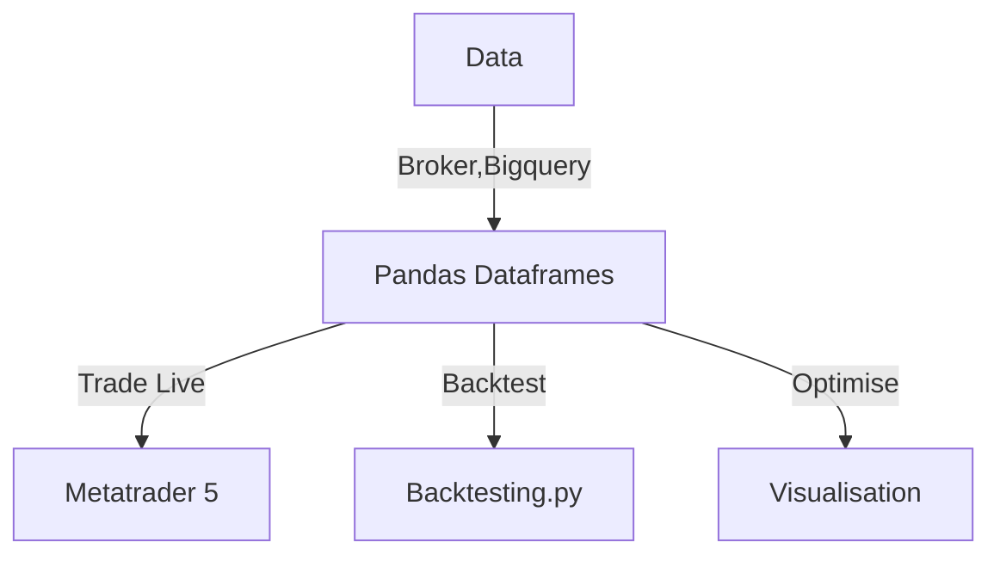

# colab-connect

Personal utility library for market data analysis on google colaboratory

* storing backtests and results for trading strategies I come across
* strategy visualisation and optimisation

