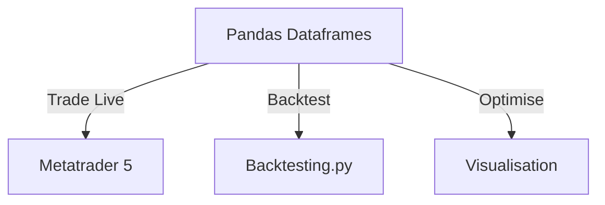

# colab-connect

My personal shared utility library for market data analysis on google colaboratory

* storing backtests for trading strategies I come across and want to try out
* strategy visualisation and optimisation

The architecture I'm aiming for:

